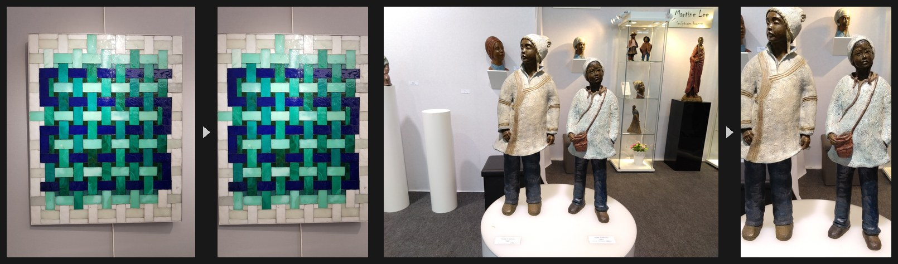
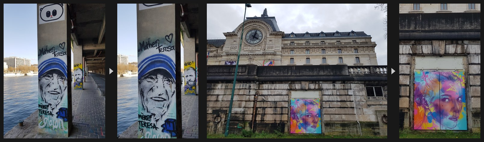

# Picture Frame Preprocessor

Smart image preprocessor for e-ink picture frames. Uses local ML to detect art subjects in museum, gallery, and street art photos, then crops and zooms to highlight them for portrait display.


## Features

- **ML-powered smart cropping** -- YOLO-World + Grounding DINO ensemble detects art, sculptures, murals, and more
- **Focal point detection** -- for large murals that fill the frame, a second Grounding DINO pass finds faces/figures inside the primary to use as the crop anchor
- **Contextual zoom** -- zooms in on small or distant subjects, leaves large ones untouched
- **Multi-crop** -- detects multiple art pieces and produces separate crops for each
- **Batch processing** -- parallel workers with model caching
- **Local processing** -- no cloud dependencies, optional OpenVINO acceleration on Intel

## Quick Start

```bash
# Setup
python3 -m venv venv && source venv/bin/activate
pip install -e .
python scripts/download_models.py

# Process a single image
frame-prep process -i photo.jpg -o output/ -v

# Batch process a directory
frame-prep batch -i ~/photos/art/ -o ~/photos/processed/ --skip-existing
```

Output is 480x800 JPEG by default (3:5 portrait ratio for e-ink frames).

## More Samples

**Gallery art** -- painting and sculpture detection with smart crop:



**Street art** -- rotated photo with subject detection:



## Documentation

- **[Usage Reference](docs/USAGE.md)** -- full CLI options, cropping strategies, performance tuning
- **[Testing Guide](docs/TESTING_GUIDE.md)** -- quality assessment with interactive HTML reports
- **[Contextual Zoom](docs/CONTEXTUAL_ZOOM.md)** -- how zoom logic works
- **[Hardware Acceleration](docs/HARDWARE_ACCELERATION.md)** -- OpenVINO and threading optimization

## Quality Assessment

```bash
# Generate interactive detection report
frame-prep report

# Opens reports/interactive_detection_report.html
# Rate results, export feedback as JSON
```

Current accuracy: ~77% on 116-image ground truth test set.

## Related Projects

- [onedrive-album-download](https://github.com/antoinecellerier/onedrive-album-download) -- download photo albums from OneDrive
- [librespot-epd-nowplaying](https://github.com/antoinecellerier/librespot-epd-nowplaying) -- Spotify now-playing display for e-ink frames

## License

[MIT](LICENSE)
